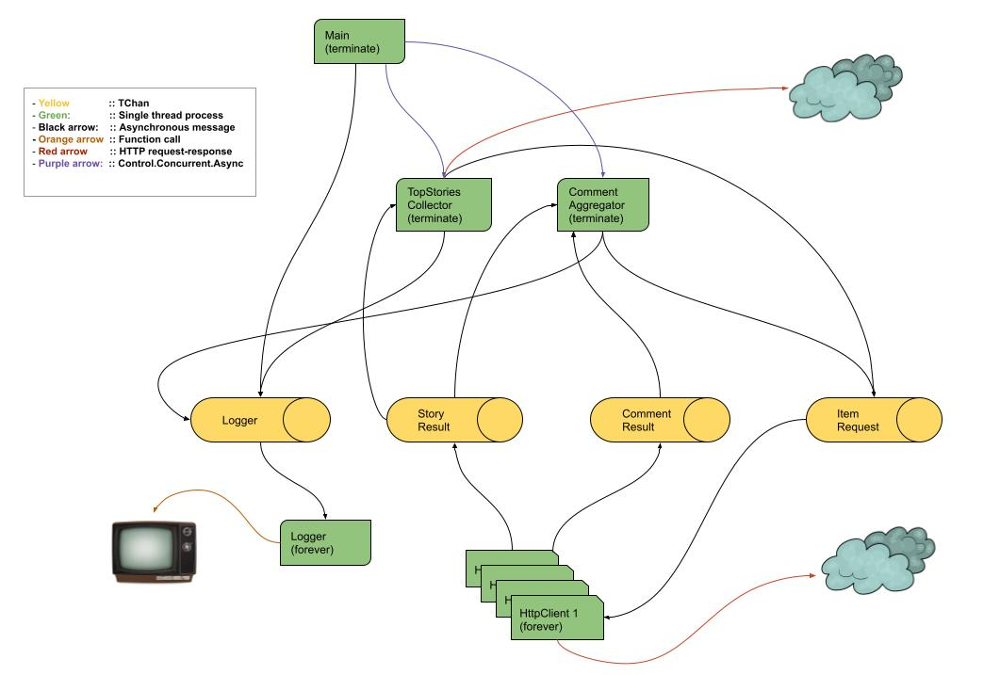

# hacker-news-aggregator

## Subject
<br />
Using the Hacker News API Documentation (https://github.com/HackerNews/API) write a program that will print the title of the top 30 hacker news stories and the top 10 commenter names of these stories with the total number of comments that they posted (only for these 30 stories). The program has to parallelize requests and aggregate the results as efficiently as possible.

<br />

## Disclaimer 
<br />
This project is not a production-ready one, just an exercise trying to achieve the requirements above, efficiency, performance and readability. In a production context, most probably, I would have made other decisions like using libraries/frameworks. Say a logger library. Also I would have used a streaming library/framework for instance **Conduit**, **Kafka**, **Flink** or **Streamly** for example. 

My intention with current design has been to play with Haskell concurrency primitives and have fun. 

**Hacker News Bug** :  There's an issue with the API (see below for details). In these cases the program ignores the empty comment and continues. 

<br />

## Design

<br />

The application architecture consists on multiple processes forked using `Control.Concurrent.Async` talking each other asynchronously through `TChan` channels. I think that the use case fits really well with a streaming design. Bellow, I detail each.

<br />

### 1. Main. 

<br />

  - Create communication channels (TChans): `ItemReqChan`, `StoryResChan`, `CommentResChan` and `LoggerChan`.

  - Fork the processes: `TopStoriesCollector`, `CommentAggregator`, `HttpClient`s and `Logger`.
  
  - Wait for any of the results provided by `TopStoriesCollector` (**Top 30 stories title**) or `CommentAggregator` (**Top 10 Commenter** names and **Total number of comments for the top 30 stories**). 
  
  - Print each result as it gets computed (don't need to wait to have all the results), and then wait for the second result. 
  
  - Cancel httpCallers and logger. (So good Async library!)

<br />

### 2. TopStoriesCollector. 

<br />

Its mission is to collect the top 30 story titles.
  
  - Request synchronously the top 30 stories in `/v0/topstories` (note: this service returns 500 stories and jobs, but we are only interested of stories)

  - For the first 30 items (stories or jobs) it triggers 30 requests `GetStory` containing the item ids into channel `ItemReqChan`. (As a spoiler, httpCallers listen to this channel in order to get the item ids, then process the stories, and finally put the results into `StoryResChan`).

  - Keep a `storyIdsReserve` list with the rest (470). (More in next point) 

  - Listen to channel `StoryResChan` where `HttpClient`s will publish the stories processed. Here, it iterates until collecting 30 processed stories, and finally returns the titles of the top stories. An interesting thing is that because the items ids previously triggered might be **jobs** we need to check whether the processed story is actually a story (**Maybe Story**). So in case of getting a non-story, we'll trigger a new request `GetStory` through `ItemReqChan` getting the itemId from `storyIdsReserve`. This way, we only request the necessary items, reducing traffic and processing.

  - Before returning the result to `Main`, we need to order the stories collected. For this, first thing we do in first step is to zip the itemIds received with indices [1..], and consequently attach the index in the request. 

<br />

### 3. CommentAggregator. 

<br />

Its mission is to collect the top 30 commenter names and count the total comments of the top 30 stories. 

  - Listen to `StoryResChan` to get the stories processed by `TopStoriesCollector`. For each collected story it gets the commentIds and then triggers multiple requests (`GetComment`) into channel `ItemReqChan` (same place as requests for stories). Also in this case `HttpClient`s will collect these requests from the channel in order to processed them, and finally put the results in channel `CommentResChan`. Once it gets the top 30 stories, it won't request more work from `HttpClient`s. Note that this collection happens sequentially with collection of comments (next step). 

  - `CommentAggregator` also listens to `CommentResChan` to get processed comments and aggregate the results (**top 10 commenter names**). Here the logic is as follows. 

     For each comment: 

      - Check that the comment collected is valid. Here, there's an issue with **HackerNews API**. The thing is that we expect comments from channel `CommentResChan`, but every now and then the API returns a **NULL** value instead of an object. This behavior is arbitrary and pretty weird because if you execute the program a bit later with exactly same number of comments, **Hacker News API** returns a valid comment object. When this occurs, the program ignores the empty comment and continues. 

      - If the comment has sub-comments it triggers requests (`GetComment`) into channel `ItemReqChan`.

      - Increment a counter called `commentsAcc` by 1 (a new comment has been processed). (The final state for the counter will be the **total number of comments**)
     
      - Update another counter called `pendingCommentsAcc` which keeps the number of comments pending to get full info and process it. The logic is: for every request (`GetComment`) triggered into channel `ItemReqChan`, we increment this counter by 1 (one comment is pending to process). On the other hand, every time we collect and process a comment the counter decreases by 1. So our aggregation will be done once `pendingCommentsAcc` equals 0. This is the last step before iterating (if so).

      - Update a queue called `aggQueue` where the aggregation magic happens. This **Priority Search Queue** is defined by two values: a **key** (commenter name) and a **priority** (commenter's number of comments). Every time a **comment** is processed we update the **priority** for the owner of the comment (**key = name**). The magic of this data structure `Data.PSQueue` is that it keeps the queue ordered on the fly. In other words, at the time of getting the final result of the aggregation, the result will be ready. On the other hand, insertions are really fast as well. Please, check library docs  ( https://hackage.haskell.org/package/PSQueue-1.1.0.1/docs/Data-PSQueue.html ) and you'll see that all operations have **O(log n)** and **O(1)**. That guy deserves the Novel prize! 

      - Finally, as I've mentioned before, we check whether `pendingCommentsAcc` equals **0**, either iterating in order to process more pending comments, or exiting with two results: (1) **the top 10 commenter names** which we get from the mentioned `aggQueue` (ordered by default), and (2), the **total number of comments** which corresponds to `commentsAcc`.

<br />

### 4. HttpClients. 

<br />

Their goal is to request **HackerNews HTTP API** and provide the results to `CommentAggregator` and `TopStoriesCollector` through the mentioned channels. The logic is simple. Here's where **parallelism** occurs (the program creates a bunch of `HttpClient`s). 

  - Listen to channel `ItemReqChan` to get command requests `GetStory` and `GetComment`.
  
  - Request **Hacker News HTTP API** with an itemId. 
  
  - Block until it gets a result.
  
  - Depending if the item is a **comment** or a **story**, we will put the result in `CommentResChan` or `StoryResChan`. 
  
  - Runs **forever** until `Main` gets the results. At that point, `Main` will **cancel** httpClients. 

<br />

### 5. Logger. 

<br />

This component is in charge of printing log messages on the terminal. For that:

  - Listen to a channel called `LoggerChan` which receives all log messages (results included) from all other components.
  - Print messages and iterates **forever** until `Main` gets the results. Same as before, `Main` will **cancel** it. 


<br />

### 6. Channels. 

<br />

Their responsibility is to facilitates **asynchronous communication** between components. 

  - `ItemReqChan` for request: `GetStory` and `GetComment`. 

      - Writers: `TopStoriesCollector` <> `CommentAggregator`
      - Readers: `HttpClient`s 
    
  - `StoryResChan` for story results.
     
      - Writers: `HttpClient`s
      - Readers: `TopStoriesCollector` <> `CommentAggregator`

  - `CommentResChan` for comment results.
  
      - Writers: `HttpClient`s
      - Reader: `CommentAggregator` 

  - `LoggerChan` for logging and **final results** messages. (Check `LogLevel`)
  
      - Writers: **all** 
      - Reader: `Logger` 

<br />


## Components diagram

<br />



<br />

## Run the program.

<br />

```bash
# run  <numberOfCores> <parallelismFactor> <numberOfStories> <numberOfTopNames> <logLevel>
cabal run hacker-news-aggregator -- 8 8 30 10 INFO

# or
time cabal run hacker-news-aggregator -- 8 8 30 10 INFO 

```
<br />

## License

[MIT](https://choosealicense.com/licenses/mit/)

Made with <span style="color: #e25555;">&#9829;</span> in Málaga by José Velasco
